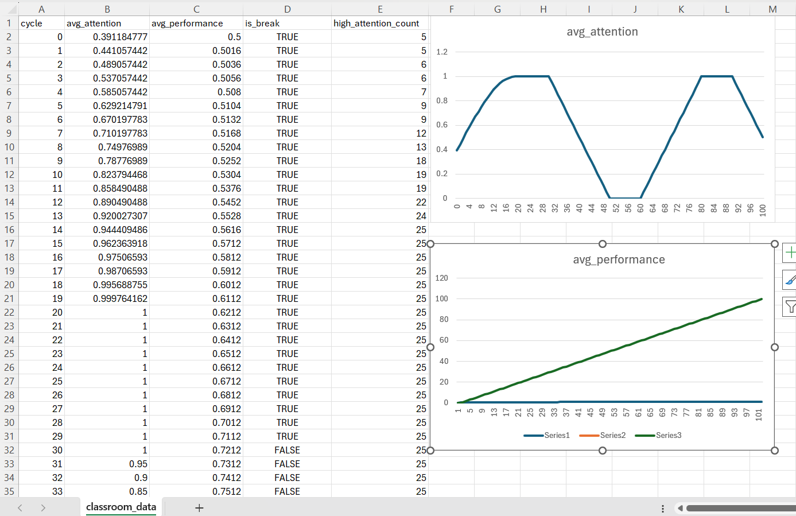
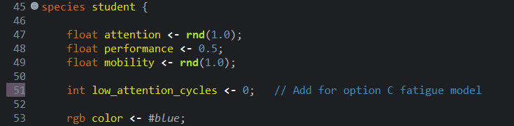
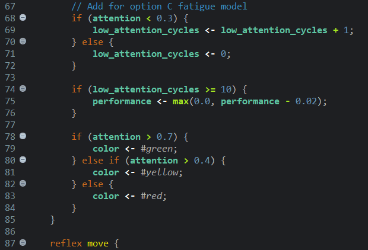

# Modeling Student Attention and Performance Using Agent-Based Simulation
# CSEL302 - Introduction to Intelligent Systems | AY 2025-2026
# BSCS-2B-Cuala

## PART 1 - Pre-Lab Concept Questions
1. What is an agent in an Agent-Based Model?
    For me, an agent in an Agent-Based Model (ABM) is an individual entity inside a simulation that can act and interact with other agents based on the certain rules. Each agents has own characteristics and behavior that may change over time during the simulation. Agent-Based Model (ABM) is a type of simulation where many agents interact with each other and with their environment to show how a system behaves as a whole. 
        -	For example, in a classroom simulation, each student can be considered an agent because every student has their own level of attention and performance that can influence the overall outcome of the simulation.

2. What is the difference between: global variables and species variables?
    # Global variables
        - For me, global variables are variables that belong to the whole simulation. This means that all agents can access and use them. They usually store information about the environment or overall settings, like the total number of students or whether its currently break time.
    # Species variables
        -	On the other hand, species variables are specific to each agent. Every agent has its own value for these variables, which can change independently. For example, in the classroom simulation, attention, performance, and mobility are species variables because each student has their own levels that can change as the simulation runs.

3. What does this expression mean? (student mean_of each.attention)
    For me, this expression calculates the average attention of all students in the simulation. Also it tells us how focused the entire class is at a given time.
    # student - is refers to all student agents
    # each.attention - This is the attention value of each student
    # mean_of - It takes the average of those values

4. What happens if attention continuously decreases without a break?
    If the attention keeps decreasing without a break, the students will gradually lose focus and their performance may drop. Over time, most students might have low attention levels, which could affect the overall outcome of the simulation. In the model, this would be shown by more students turning red, meaning they are not paying attention, and the average attention of the class would go down.

## PART 2 - Run the Base Model
Step 1 Run the provided model
Step 2 Observe: Student movement, Color changes, Monitor values
Step 3 Open the generated file: classroom_data.csv

## PART 3 - Data Observation Table
Fill in the table after 100 cycles:
 |       **Metric**                 |       **Value**                                 |
 | -----------------------------------------------------------------------------------|
 | Average Attention            |       0.80                                          |
 | Average Performance          |       1.0                                           |
 | High Attention Count         |       25                                            |
 | Number of Breaks Occurred    |2 breaks (0-29 1st break and 60-89 2nd break period) |

     
## PART 4 - Guided Code Analysis
# Activity 1: Break Frequency 
    Original code: if (cycle mod 30 = 0) 
    Task: Change break interval to: 15 cycles 

# Question:
1. Does attention increase faster? 
    - Yes, the attention increases faster because breaks now happen more frequently (every 15 cycles instead of 30) which gives students more chances to recover their focus.
2. Does performance grow faster? 
    - Yes, the performance grows faster as well since students maintain higher attention levels more often, which allows their performance to improve consistently.
3. Is the system more stable? 
    - Yes, the system is more stable because of students attention and performance fluctuate less resulting in more consistent behavior throughout the simulation

# Activity 2: Attention Decay Rate
    Original: attention <- max(0.0, attention - 0.02);
    Task: Change decay rate to: 0.05

# Observe:
1. Does attention collapse? 
    - Yes, attention drops much faster now because it decreases more quickly each cycle. The students spend more time losing focus, especially if breaks dont come often enough.
2. Does performance still improve? 
    - Performance still improves, but more slowly because students need to have attention above a certain level to increase their performance.
# Explanation:
    Since attention falls faster with the higher decay rate, students cannot stay focused long enough to consistently improve. Even though breaks help, the faster drop makes it harder for most students to maintain high attention, which affects overall class behavior.

# Activity 3: Performance Growth Condition
    Original: if (attention > 0.6)
    Task: Change threshold to: 0.8

# Questions:
1. Does performance improve slower? 
    - Yes the performance improves a bit slower now because students have to pay a lot more attention to 0.8 so it get better. Since not everyone is that focused at all the time, it takes longer for the class as a whole to improve.
2. What does this represent in real classroom settings?
    - This is like a real life when students can only really learn if they are fully focused. If their attention is only halfway, they might understand a little but won’t make big progress. It shows that high focus is really important for learning.

## PART 5 - Experiment: Class Size Impact
Use parameter: Initial number of students
Test:
# | Students  |   Avg Attention   |   Avg Performance
  |   10      |       0.88        |       0.55
  |   25      |       1.0         |       0.69
  |   60      |       0.0         |       0.95
  |   100     |       0.5         |       0.95
# Analysis Questions:
1. Does increasing class size affect average attention? 
    - Yes, class size affect average attention, but not always in a simple way. With a small class of 10 or 25 students, attention is high, but when the class grows to 60 students, attention drops a lot. At 100 students, attention goes up a little again. This shows that bigger classes can make it harder for everyone to stay focused.
2. Does mobility create more randomness? 
    - Yes, mobility are unpredictable. Since students move around in different directions and speeds, their interactions change constantly. This is why attention and performance values can fluctuate even if the rules for each student are simple
3. Is emergent behavior visible? 
    - Yes, the patterns in the class even though each student is just following simple rules. For example, some students naturally stay more focused while others lose attention, and these patterns form clusters or groups in the classroom. It shows that big group behavior can appear just from the small actions of individual students.

## PART 6 - Data Analysis Task (Optional Python)
Using Excel or Power Query Editor
1. Load classroom_data.csv
2. Plot:
    - Attention vs Cycle
    - Performance vs Cycle
3. Identify break cycles.
4. Compute correlation between attention and performance.

# Question:
Is performance strongly dependent on attention?
    - Looking at the graph, performance generally increases when attention is high and stays low when attention is low for a long time. For example, in cycles 0–20, as attention rises from ~0.39 to 1, performance also slowly increases from 0.5 to ~0.62. Later, even when attention drops to 0, performance stays mostly the same because of the way the model updates performance. So in this model, performance depends on attention, but not perfectly its influenced more strongly when attention is high, and less when attention is low or at extremes.

## PART 7 - Critical Thinking Questions
1. Why does performance only increase when attention > 0.6?
    - In the model performance only improves when attention is higher than 0.6 because it assumes that students need to be focused enough before they can actually learn something. If their attention is too low, they probably wont understand the lesson well, so their performance wont really improve.
2. Is this model deterministic or stochastic?
    - The model is stochastic because some parts of it use randomness. Like for example, the students attention and mobility start with random values, and their movement is also random. Because of this, the results can be a bit different every time the simulation runs.
3. What real-world classroom factors are missing?
    - The model does not include many real-life factors that can affect students in a classroom. Like teaching methods, student motivation, and the overall classroom environment are not part of the simulation, even though they can influence attention and performance.
4. How would peer influence affect the system?
    - The peer influence could affect how students behave in the system. The behavior or focus of one student could influence others around them, which might change the overall attention and performance patterns in the class.

## PART 8 - Advanced Extension Tasks (Choose One)
# Option A: Peer Influence
Add logic:
- Students near high-attention peers increase attention.
# Option B: Teacher Agent
Add a teacher species that:
- Increases nearby students attention.
- Reduces mobility.
## Option C: Fatigue Model (CHOOSEN)
Add:
- If attention < 0.3 for 10 cycles -> performance decreases
# I CHOOSE OPTION C: FATIGUE MODEL AND I MODIFIED THE CODE IN GAMA 

# Here my Explanation

    - For this part, we added a fatigue rule. If a students attention stays really low below 0.3 for 10 cycles, their performance starts to drop. This shows that if someone stays unfocused for a long time, it can affect how well they learn. The model keeps track of how long attention is low, and once it reaches 10 cycles, performance decreases a little. If attention goes back up, the count resets. This makes the simulation feel more realistic because it shows how losing focus for too long can hurt learning, not just temporary distraction
