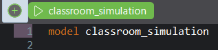
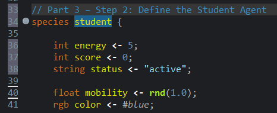
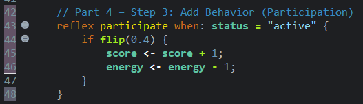
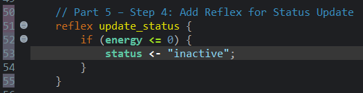
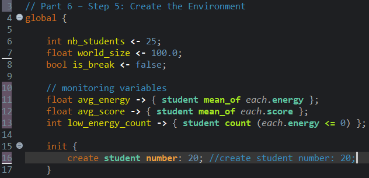
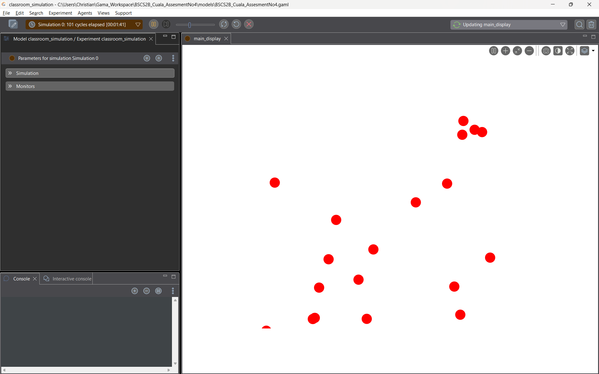

# BSCS-2B-Cuala

## Part 1 - Simulation Scenario
You will create a simple classroom participation simulation.
Each student agent has the following attributes:

| Attribute | Description |
|-----------|-------------|
| energy    | ability of the student to participate |
| score     | participation score |
| status    | active or inactive |

## Rules
1.	Students may participate in class.
2.	When participating:
    o score increases by 1
    o energy decreases by 1
3.	When energy reaches 0, the student becomes inactive

## Part 2 - Step 1: Create the Model
Create a new GAMA model.
Example: model classroom_simulation    

## Part 3 - Step 2: Define the Student Agent
Create a student species.
Example:
species student 
{
   int energy <- 5;
   int score <- 0;              
   string status <- "active";
}

## Part 4 - Step 3: Add Behavior (Participation)
Students randomly participate in class.
Example:
reflex participate when: status = "active" {

   if flip(0.4) {
      score <- score + 1;    
      energy <- energy - 1;
   }
}
## Explanation:
### flip(0.4) means 40% chance of participation.
- means there is a 40% chance that a student will participate in each cycle. This simulates how students do not always choose to engage in every activity, just like in a real classroom where some students are more active than others. Each time the simulation runs, the outcome is random, which makes the behavior of each student unique and unpredictable.

## Part 5 - Step 4: Add Reflex for Status Update
When energy becomes 0, change the status.
reflex update_status 
{
   if energy <= 0 {         
      status <- "inactive";
   }
}

## Part 6 - Step 5: Create the Environment
Add the global section.
global 
{
   init {
      create student number: 20;        
   }
}

## Part 7 - Step 6: Run the Simulation
Observe the following:
• Which students participate the most
• How energy changes over time          
• When students become inactive

## Part 8 - Guide Questions
Answer the following questions.
### 1.	What happens to students when energy reaches 0?
When a student's energy reaches 0, they become inactive. This means they can no longer participate in class activities for the rest of the simulation. Think of it like a student who has used up all their energy and just sits quietly for the remainder of the class.

### 2.	How does participation affect score and energy?
Every time a student participates their score goes up by 1 while their energy goes down by 1. So the more a student participates, the higher their score gets but at the cost of their energy. It is a trade-off active students earn more points but also run out of energy faster.

### 3.	If participation probability increases to 0.8, what happens?
If the probability is raised to 0.8, students will participate more frequently since they now have an 80% chance of engaging each cycle. This means scores will rise faster, but energy will also drain much quicker, causing students to become inactive earlier than usual. The simulation would feel more intense and fast-paced compared to the default 40%.

### 4.	What pattern do you observe in the simulation?
At the start, most students are active and participating regularly. Over time their energy slowly decreases until some of them become inactive. Students who got lucky with more participation early on tend to have higher scores but become inactive sooner, while less active students last longer but with lower scores. This creates an interesting pattern where the classroom gradually becomes quieter as more students run out of energy.
